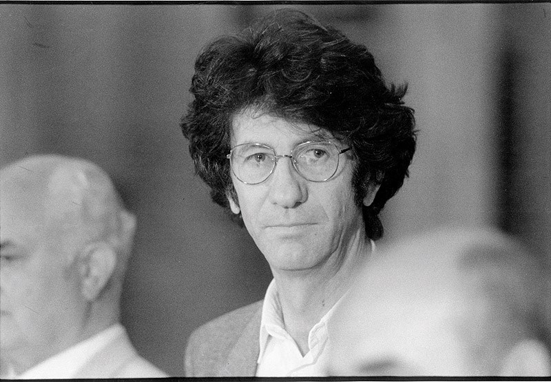

[translated by Ivana Đorđević]

Nationalism is first and foremost paranoia. Collective and individual paranoia. As collective paranoia it results from envy and fear, and most of all from the loss of individual consciousness; this collective paranoia is therefore simply an accumulation of individual paranoias at the pitch of paroxysm. If, in the framework of a social order, an individual is not able to “express himself,” because the order in question is not congenial and does not stimulate him as an individual, in other words does not allow him to assume an entity of his own, he is obliged to search for this entity outside identity and outside the so-called social structure. Thus he becomes a member of a pseudo-masonic group which seems to pose problems of epochal importance as its goals and objectives; the survival and prestige of a nation or nations, the preservation of tradition and the nation’s sacrosanct values – folkloric, philosophical, ethical, literary, et cetera. Invested with such a secret, semi-public, or public mission, A. N. Other becomes a man of action, a tribune of the people, a semblance of an individual. Once we have him cut down to size, isolated from the herd, and out of the pseudo-masonic lodge where he has installed himself or been installed by others, we are faced with an individual without individuality, a nationalist, cousin Jules.

This is the Jules that Sartre wrote about, a zero in his family, a man whose only distinction is that he can blanch at the mere mention of a single topic: the English. This pallor, this trembling, this “secret” – to be able to blanch at the mention of the English – constitute a social being and make him important, existent: do not mention English tea in front of him, or the others will start winking and signalling, kicking you under the table, because Jules is touchy about the English, good God, everybody knows that, Jules detests the English (and loves his own folk, the French), in a word, Jules is a personality, becomes a personality, thanks to English tea.

This kind of profile, which fits all nationalists, can be freely elaborated to its conclusion: the nationalist is, as a rule, equally piffling as a social being and as an individual. Outside the commitment he has made, he is a nonentity. He neglects his family, his job (usually in an office), literature (if he is a writer), his social responsibilities, since these are all petty compared with his messianism. Needless to say, he is by choice an ascetic, a potential fighter biding his time. Paraphrasing Sartre on anti-Semitism, nationalism is a comprehensive and free choice, a global attitude not only toward other nations but toward people in general, toward history and society; it is at once a passion and a world-view.

The nationalist is by definition an ignoramus. Nationalism is the line of least resistance, the easy way. The nationalist is untroubled, he knows or thinks he knows what his values are, his, that;s to say national, that’s to say the values of the nation he belongs to, ethical and political; he is not interested in others, the are no concern of his, hell – it’s other people (other nations, other tribes). They don’t even need investigating. The nationalist sees other people in his own image – as nationalists. A comfortable standpoint, as we noted. Fear and envy. A commitment and engagement needing no effort. Not only is hell other people, in a national key of course, but also: whatever is not mine (Serbian, Croatian, French…) is alien to me. Nationalism is an ideology of banality. As such, nationalism is a totalitarian ideology.

Nationalism is moreover, and not only in the etymological sense, the people. Writers know this best. That’s why every writer who declares that he writes “about the people and for the people,” who claims to surrender his individual voice to the higher interest of the nation, should be suspected of nationalism. Nationalism is also kitsch: in its Serbo-Croatian variant it takes the form of squabbling over that national origins of those traditional gingerbread hearts topped with coloured sugar – are they from Serbia proper or from Vojvodina exclusively?

As a rule the nationalist doesn’t know a single foreign language or any variant of his own, nor is he familiar with other cultures (they are no concern of his). But there is more to it than this. If he does know foreign languages, which means that as an intellectual he has an insight into the cultural heritage of other nations, great or small, they serve only to let him draw analogies, to the detriment of those others, naturally. Kitsch and folklore, folkloric kitsch, if you prefer, are nothing but camouflaged nationalism, a fertile field for nationalist ideology. The upsurge in folklore studies, both in this country and in the world at large, is due to nationalism, not anthropology. Insisting on the famous couleur locale is likewise, outside an artistic context (that is, unless in the service of artistic truth), a covert form of nationalism.

Nationalism is thus, in the first place, negativity; nationalism is a negative spiritual category because it thrives on denial and by denial. We are not what they are. We are the positive pole, they the negative. Our values, national, nationalist, have no function except in relation to the nationalism of those others: we are nationalist, but they are even more so; we slit throats (when we must) but they do too and more; we are drunkards, they are alcoholics; our history is proper only in relation to theirs; our language is purely in relation to theirs. Nationalism lives by relativism. There are no general values – aesthetic, ethical, et cetera. Only relative ones. And it is principally in this sense that nationalism is reactionary. All that matters is to be better than my brother or half-brother, the rest is no concern of mine. To jump not very high but higher than him; the others do not count. This is what we have defined as fear. Others are allowed to catch us up, even to overtake us; that is no concern of ours. The goals of nationalism are always attainable, attainable because modest, modest because mean. You don’t go jumping or shot-putting to reach your own best but to beat the only others who matter, so similar and so different, on whose account you took the field.

The nationalist, as we noted, fears no one but his brother. But him he fears with an existential, pathological dread; for the chosen enemy’s victory is his own total defeat, the annihilation of his very being. As a shirker and a nonentity the nationalist does not aim high. Victory over the chosen enemy, the other, is total victory. This is why nationalism is the ideology of hopelessness, the ideology of feasible victory, victory that is guaranteed and defeat that is never final. The nationalist fear no one, “no one save God,” but his God is made to his own measure, it is his double sitting at the next table, his own brother, as impotent as himself, “the pride of his family,” a family entity, the conscious and organised section of the family and the nation – pale Cousin Jim.

To be a nationalist is therefore to be an individual with no obligations. It is to be a “coward who will not admit his cowardice; a murderer who represses his murderous proclivities without being able to master them, yet who dares not kill except in effigy, or in the anonymity of the crowd; a malcontent who, fearing the consequences of rebellion, dares not rebel” – the spitting image of Sartre’s anti-Semite. Whence, we wonder, such cowardice, such an attitude, such an upsurge of nationalism, in this day and age? Oppressed by ideologies, on the margin of social changes, crammed and lost between antagonistic ideologies, unequal to individual rebellion because it is denied to him, the individual finds himself in a quandary, a vacuum; although he is a social being, he takes no part in social life; although an individualist, individuality has been refused him in the name of ideology; what is left but to seek his being elsewhere? The nationalist is a frustrated individualist, nationalism is the frustrated (collective) expression of this kind of individualism, at once ideology and anti-ideology…
