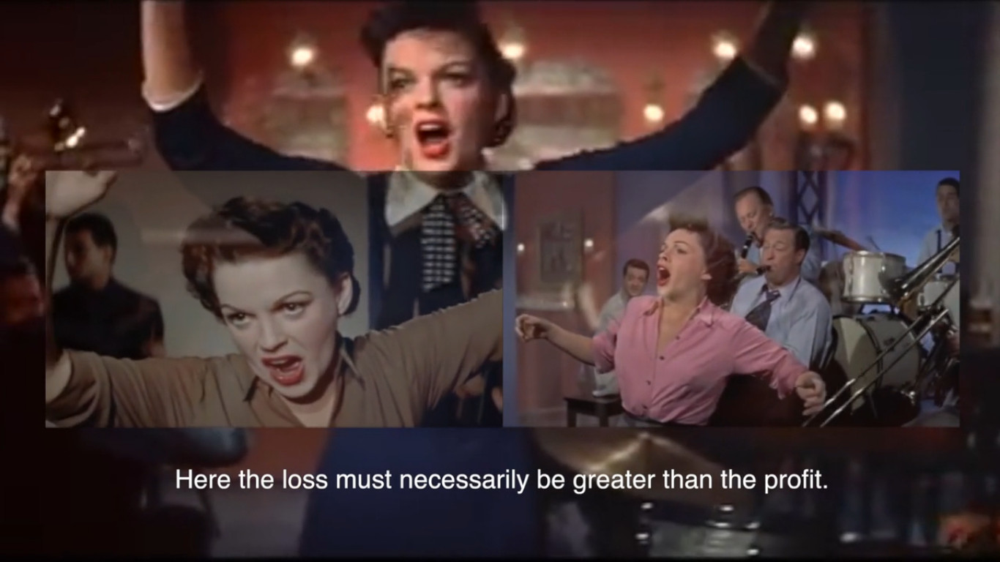

  

(still from [_JUDY FOUR TIMES_](https://vimeo.com/419995325/53ce74e295), 2020)
  
Below is a selection - for a full list of works, see [this page](https://rosedetivoli.github.io/all_works/).  

[Pelyno Marija / Wormwood Maria](https://rosedetivoli.github.io/wormwoodmaria/) (with Beatričė Bukantytė, 2021)  
[Where Were You in 1992?](http://1992.maydayrooms.org) (ongoing project with Amanda Egbe, 2018 -)  
[Concrete Heart Land](http://concreteheartland.info) (with Steven Ball, 2014)  
[Ripples](https://rosedetivoli.github.io/april_showers/) (2011)  
[Waldron Panorama](https://rosedetivoli.github.io/waldron/) (with Amanda  Egbe, Oct 2010 – Feb 2011)  
[lebensraum | living space](https://rosedetivoli.github.io/lebensraum/) (with Ger Duijzings, 2010/2020)  
[Deptford | Tributes](https://player.vimeo.com/video/129543067) (with Amanda  Egbe, 2009)  
