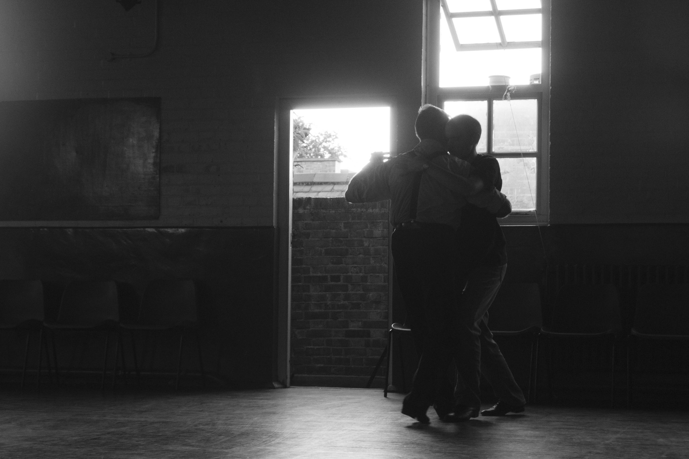

**What can queer tango learn from intersectionality?**  
_(a workshop delivered at Queer Tango Salon, London 2017)_  
Carolyn and Rastko  

_Original invite:_

_In this workshop, we will collectively come up with a working definition of
“intersectionality”. By looking at interlocking oppression and privilege which
stem from gender, race, class, sexuality, dis/ability, nationality etc., in the
context of queer tango we will ask:_

_- What spaces, processes or factors exclude certain groups of dancers?_  
_- What are the pros and cons of mainstream gay culture for queer tango?_  
_- What would a truly intersectional queer tango community look or feel like?_  

_We will explore gender dynamics on the dance floor, so please bring your
dancing shoes, but also, bring an item (an accessory or garment) which
you can exchange with others during the workshop._

We presented a workshop on the subject of intersectionality. We only had limited time and
a small group of people (which included non-dancers as well as some folk with many years
of dancing experience). We used the concept of intersectionality to interrogate our own
experiences, and ask some questions, without necessarily aiming to find answers in what
was a very small group, but with the hope that we would take these questions back to the
places where we dance. These notes sum up and build on the discussions we had.

Intersectionality defined: A systemic and structural matrix of oppression and privilege affects us all according to Class - Gender - Race - Wealth - Dis/ability - Care commitments - Age - Body image - Language - Nationality and passport - Job/Housing security - Wage slavery... Any examination of oppression shows that various kinds of oppression intersect. Oppression in the capitalist world plays out as about economic power/access to money/time as well as multiple other effects on daily life. In a patriarchal/racist world it’s not just about the money, also about things like risk of physical attack in the street outside the venue. Racism contributes to and exacerbates the inequality of access to tango culture. Patriarchy poisons people’s minds and patriarchal binaries and leader-follower expectations also infect our spaces insidiously, even in queer tango.

Resistance to oppression by the tango community – i.e. those of us who organise promote
and attend events – can take many forms.

- We should consider where money from our tango activities goes. Rampant gentrification
is hitting the kind of low-income neighbourhoods where tango historically flourished in
Buenos Aires and London’s queer spaces are being closed down due to extreme
development pressures. Our choice of venue is critical if we want to avoid contributing to
gentrification and displacement of long-standing residents, amenities, businesses and
communities.

- We can actively choose not to exclude those with low or no income from attending
milongas and practicas (and the Queer Tango Salon itself). It is often obvious that those
setting the prices have no idea of just how poor some of us are. If somebody is reliant on
benefits due to unemployment, and receiving just £10/day to live on (less if under the age
of 25) - is offering a slight, tokenistic 'concession' really going to make the event something
they can afford to attend? The Queer Tango Salon expected people in this category to pay
a minimum of £20 just to attend for one day - and we wonder why our numbers are so
low?! To counter this, we could offer a "sliding scale" or meaningful concessions. We could
also advertise events in ways that make it clear that nobody will be turned away for lack of
funds. There are plenty of examples which other groups and communities use we can
draw on.

- We can expand our understanding of who might participate in this kind of social dancing
(in the workshop people mentioned projects which aim to introduce the benefits of dance
to Deaf people, those with dementia, wheelchair users etc.).

- We can continue to promote a more communal approach to social dancing which is not
ego-driven performative/competitive and take this to the mainstream tango world.

- We can use accessible, safe venues and advertise the ways in which we’ve improved on
access and safety.

- We can change the dynamics of the dance floor to be more inclusive to gender-fluid and
less able-bodied people, more elderly people.

- We can actively promote the inclusion of black and brown people.

- We can reclaim the rebellious, anti-capitalist, anti-normative, transformative spirit of
queerness.

- We can celebrate the migrant-friendly, internationalist spirit of tango.

We invite you to reflect about these issues, and other ways in which environments we
create either perpetuate oppression or don’t go far enough to challenge it. Reach out to
other queers who are not usually seen at tango events, ask yourself why and find ways to
bring them in. Find allies in queer communities and the mainstream tango world. We would
also be happy to hear from you: **queertango@aktivix.org**.
